```{r setup, include=FALSE}
options(htmltools.dir.version = FALSE)
knitr::opts_chunk$set(collapse = TRUE,
                      fig.retina = 3)

library(ymlthis)
library(tidyverse)
```

layout: true

<a class="footer-link" href="https://sisteranalyst.org">sisteranalyst.org</a>

---

class: title-slide, center, bottom

# `r rmarkdown::metadata$title`

## `r rmarkdown::metadata$subtitle`

### `r rmarkdown::metadata$author` &#183; Tijana Blagojev &#183; Katarina Kosmina

---
class: inverse, middle

Hi, Welcome to the **<span style="color:#00B2EE">'Build a website with blogdown in R'</span>** workshop.

I'm Tanja!! A Data Scientist with a doctorate in Statistics from [the University of Manchester](https://www.manchester.ac.uk/). I have spent many years working in the U.K. university sector as a senior lecturer. I am the founder of [Sister Analyst](https://sisteranalyst.org), an organisation aiming to empower women from a diverse range of backgrounds through the development and advancment of data skills. [Sister Analyst's website](https://sisteranalyst.org) is just one of the websites I have built using [blogdown](https://cran.r-project.org/web/packages/blogdown/index.html) in [RStudio](https://rstudio.cloud/). 
 
The goal of our workshop is to work through the material and to learn how to use [blogdown](https://cran.r-project.org/web/packages/blogdown/index.html) package to make a website.

---
class: freight-slide, center, middle, inverse

.pull-left[
### Tatjana Kecojevic 


[`r icon::fa("github")` @TanjaKec](https://github.com/tanjakec)  
[`r icon::fa("twitter")` @Tatjana_Kec](https://twitter.com/tatjana_kec)

]

.pull-right[
### a few self-knitted websites 

[BeoPlace.space](https://beoplace.space/)

[SisterAnalyst.org](https://sisteranalyst.org/)

[Covid-19 SR](https://covid19sr.rbind.io/)

[WiDS Subotica 2020](https://suwids2.netlify.app/)

[Data Literacy](https://dataliteracy.netlify.app/)

[Klik-R](http://klikr.rbind.io/)

[WiDS Subotica 2019](https://widssubotica.netlify.app/)

]

---
class: freight-slide, center, middle, inverse

# .emphasis[we are a team]

.pull-left[
### Tijana Blagojev 


[`r icon::fa("github")` @tikiblagojev](https://github.com/tikiblagojev)  
[`r icon::fa("twitter")` @tikiblagojev](https://twitter.com/tikiblagojev)

]


.pull-right[
### Katarina Kosmina  


[`r icon::fa("github")` @KosmiKatarina](https://github.com/KosmiKatarina)  
[`r icon::fa("twitter")` @KosmiKatarina](https://twitter.com/KosmiKatarina)

]

---
class: freight-slide, center, middle, inverse

# .emphasis[we are part of R-Ladies Belgrade]


[`r icon::fa("github")` @RLadiesBelgrade](https://github.com/RLadiesBelgrade)  

[`r icon::fa("twitter")` @RLadiesBelgrade](https://twitter.com/RLadiesBelgrade)

[`r icon::fa("meetup")` @rladies-belgrade](https://www.meetup.com/rladies-belgrade/)

---
class: inverse, middle
.emphasis[Go to <https://github.com/TatjanaKec/eRum2020_WS> to download the material.]

```{r, out.width = "550px", fig.align = 'center', echo=FALSE}
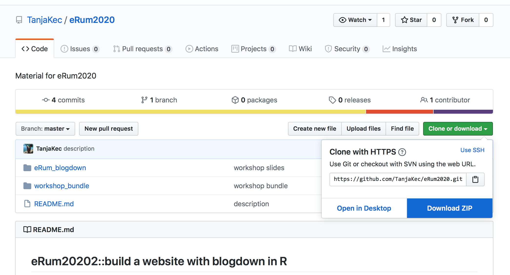
```

```{r, out.width = "550px", fig.align = 'center', echo=FALSE}
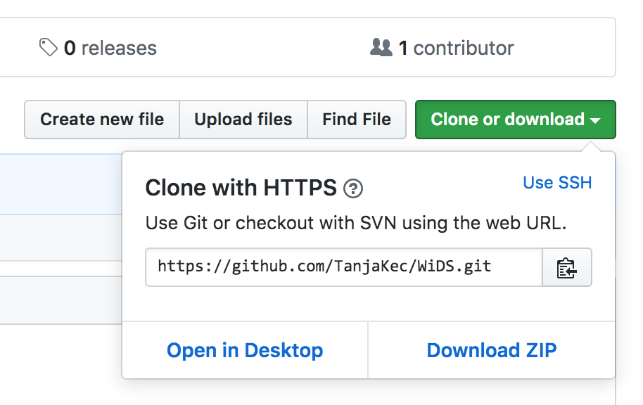
```

---
class: inverse, center, middle

# .emphasis[Get Started] 🤫😴


---

class: center, middle

#### `blogdown` <- a package based on R Markdown and Hugo

```{r, out.width = "600px", echo=FALSE}
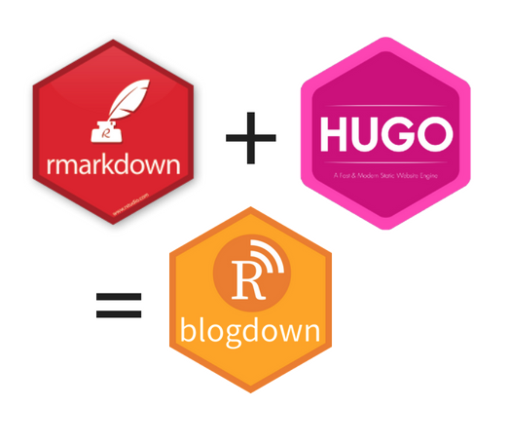
```

---
#### .emphasis[So what is blogdown?<sup>*</sup>]

- [R Markdown](https://rmarkdown.rstudio.com) 

    - (relatively) simple syntax for writing documents
    - the simpler, the more portable (multiple output formats)
    - not only convenient (maintenance), but also reproducible
    - most features of R Markdown _and_ [**bookdown**](https://bookdown.org) (technical writing)!!
 
.footnote[
[\*] From Yihui: https://slides.yihui.name/2017-rmarkdown-UNL-Yihui-Xie.html#35.
]    
--

- [Hugo](https://gohugo.io) 

    - free, open-source, and easy to install (a single binary)
    - lightning fast (generates one page in one millisecond)
    - general-purpose (not only for blogs)


---
#### .emphasis[Why not WordPress, Tumblr, Medium.com, Blogger.com, etc?<sup>*</sup>]

- No R Markdown support (even maths support is often nonexistent or awkward)

.footnote[
[\*] From Yihui: https://slides.yihui.name/2017-rmarkdown-UNL-Yihui-Xie.html#36.
]
--

- Huge benefits of static websites compared to dynamic websites
    - all static files, no PHP or databases, no login/password, work anywhere (even offline)
    
    - typically fast to visit (no computation needed on the server side), and easy to speed up via CDN

---
class: inverse, center, middle

# Let us start practising Elaine's Dance!!! 😃🎵🎶
```{r, out.width = "300px", fig.align = 'center', echo=FALSE}

```

---
## Prep with GitHub

The workshop will not go through [Happy Git with R](http://happygitwithr.com) to connect RStudio with your GitHub account.


We are going to assume that you are already familiar and have done:

☑️ Chapter 5: [Register a GitHub account ](http://happygitwithr.com/github-acct.html)

☑️ Chapter 6: [Install or upgrade R and RStudio ](http://happygitwithr.com/install-r-rstudio.html)

---
- Go to your GitHub account and create a new repository
```{r, out.width = "200px", fig.align = 'right', echo=FALSE}
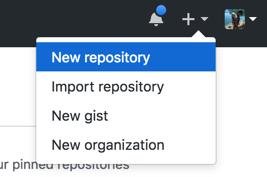
```

- Give it a meaningful name 
```{r, out.width = "300px", fig.align = 'center', echo=FALSE}
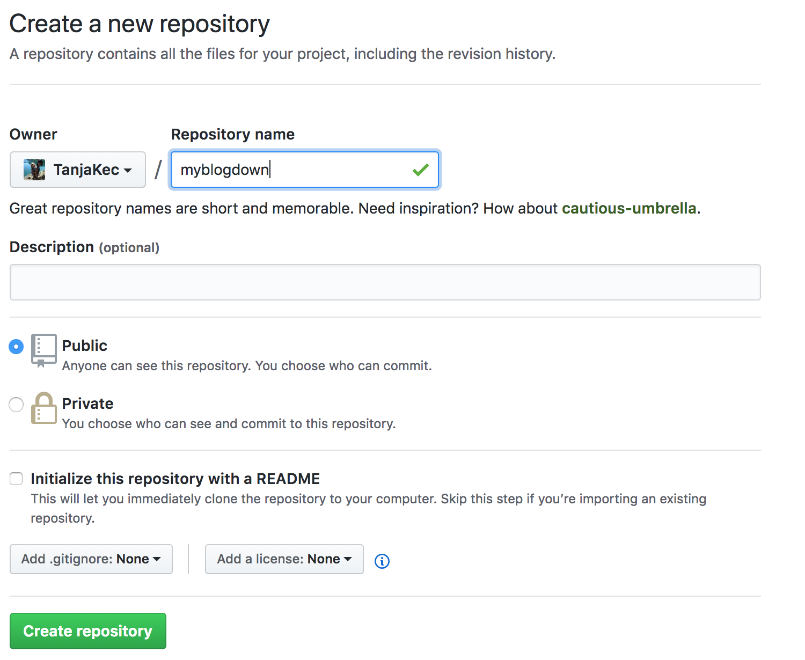
```

- Copy repo's **HTTPS** address
```{r, out.width = "350px", fig.align = 'center', echo=FALSE}
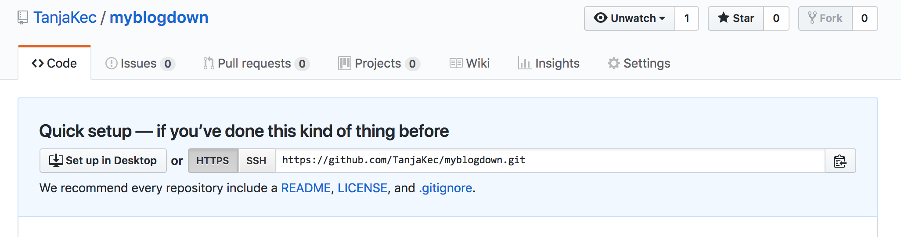
```

---
- Open a new project in RStudio: **File** ➡️ **New Project...**
```{r, out.width = "250px", fig.align = 'center', echo=FALSE}
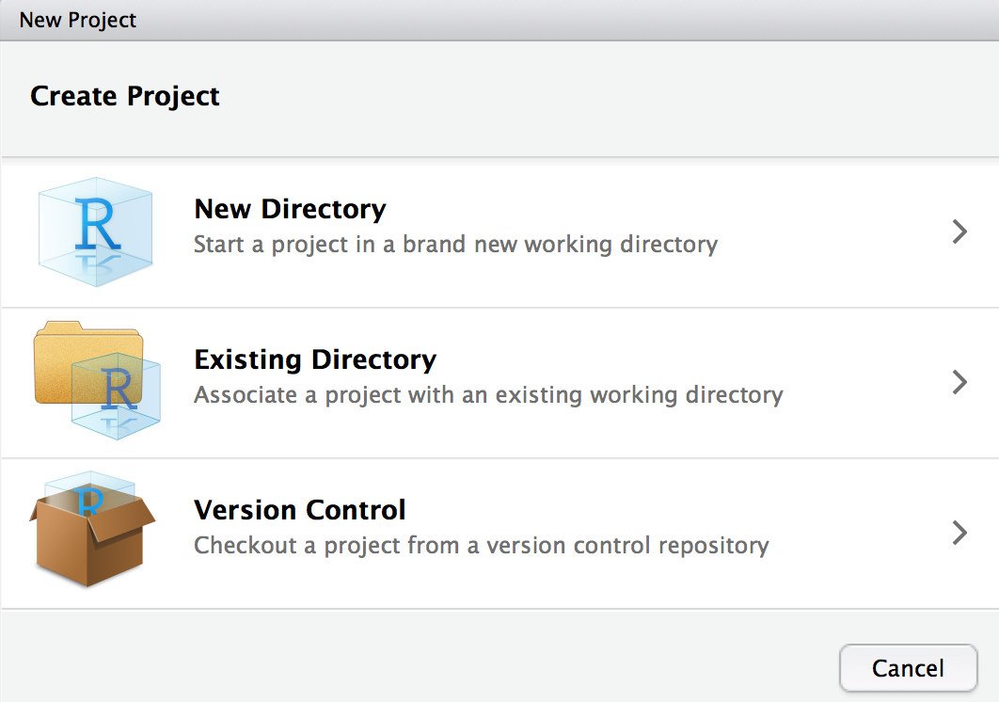
```
- Select **Version Control** ➡️ **Git**
```{r, out.width = "250px", fig.align = 'center', echo=FALSE}
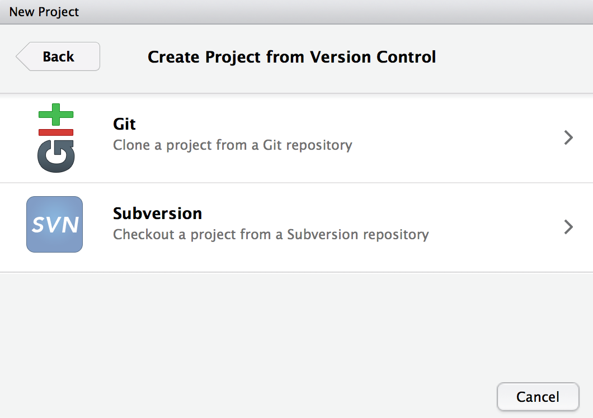
```

- Paste the address of your Git repo  
```{r, out.width = "250px", fig.align = 'center', echo=FALSE}
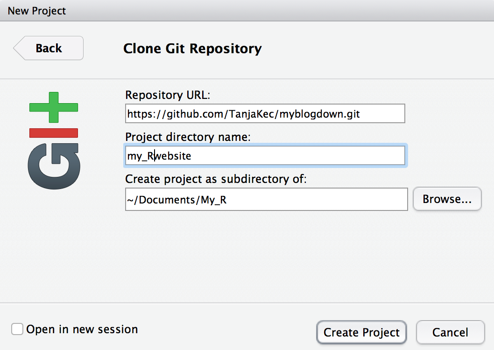
```

---
## Install the packages

Install <span style="color:#EEAD0E">`blogdown`</span>*</sup>

```{r eval=FALSE}
install.packages("blogdown")
```

Install <span style="color:#EE1289">`Hugo`</span> using blogdown
```{r eval=FALSE}
blogdown::install_hugo()
```

If you already have those packages installed you can check to update your <span style="color:#EE1289">`Hugo`</span> package
```{r eval=FALSE}
blogdown::hugo_version() # check version
blogdown::update_hugo() # force an update
``` 

---
## .shadow-text[If you **do need to**] .emphasis[upgrade or reinstall Hugo] 

You may use 
```{r eval=FALSE}
blogdown::update_hugo()
```
This is equivalent to 
```{r eval=FALSE}
install_hugo(force = TRUE)
```

You can check the installed Hugo version via 

```{r eval=FALSE}
blogdown::hugo_version()
```

and find the latest version of Hugo at <https://github.com/gohugoio/hugo/releases>.

---
class: inverse, center, middle
# Let's build a website...

```{r, out.width = "250px", echo=FALSE, fig.align = 'center'}
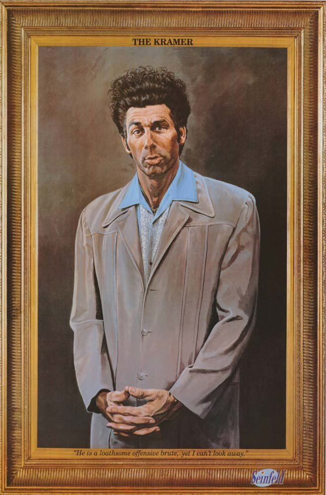
```

---
#### Build a website

We'll adopt a *simple is beautiful* approach and start building a website using a `default theme`*</sup>.

```{r eval=FALSE}
blogdown::new_site()
```

To use a different theme (for example: `hugo-academic`):

```{r eval=FALSE}
blogdown::new_site(theme = "gcushen/hugo-academic", 
                   theme_example = TRUE)
```

To see the current **Hugo themes** go to <https://themes.gohugo.io/>.


---
class: freight-slide, center, middle, inverse


## .shadow-text[Let the knowledge and familiarity with `blogdown` and `Hugo` grow first.] 🧐 

.emphasis[Once you get familiar with `blogdown` and `Hugo` you can always switch to a different theme. 

💇

https://bookdown.org/yihui/blogdown/other-themes.html]

---

## Structure of a HUGO site

.pull-left[
```{r, out.width = "325px", fig.align = 'center', echo=FALSE}
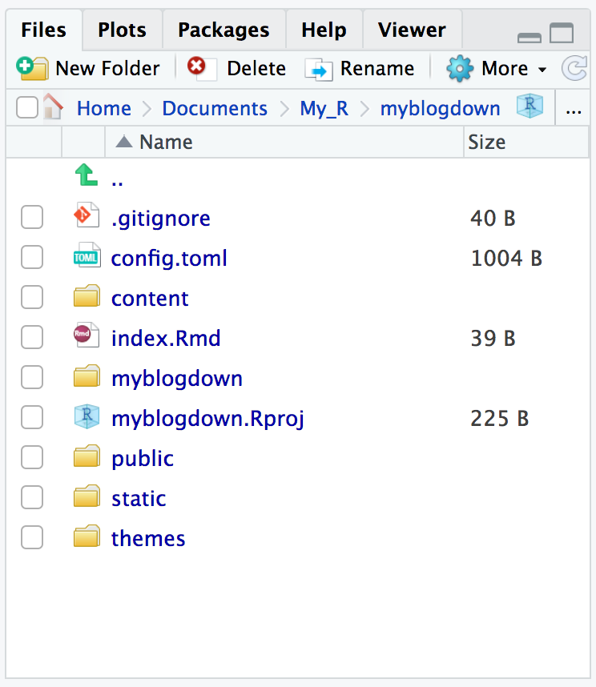
```
]
.pull-right[
```{r, eval=FALSE}
.
|
├── archetypes
├── config.toml #<<
├── content
├── data
├── layouts
├── static 
└── themes
```
]

<https://bookdown.org/yihui/blogdown/a-quick-example.html>
<https://gohugo.io/getting-started/directory-structure/>

---
## Serve site

In console type:
```{r eval=FALSE}
blogdown::serve_site()
```
.pull-left[
or, from `Addins` menue select `Serve Site` 

```{r, out.width = "300px", fig.align = 'center', echo=FALSE}
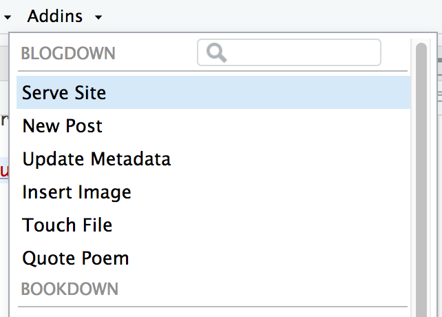
```
]

.pull-right[
Don't try to view your site in your little RStudio viewer, instead click on <span style="color:#00B2EE">`Show in new window`</span>.

```{r, out.width = "300px", fig.align = 'center', echo=FALSE}
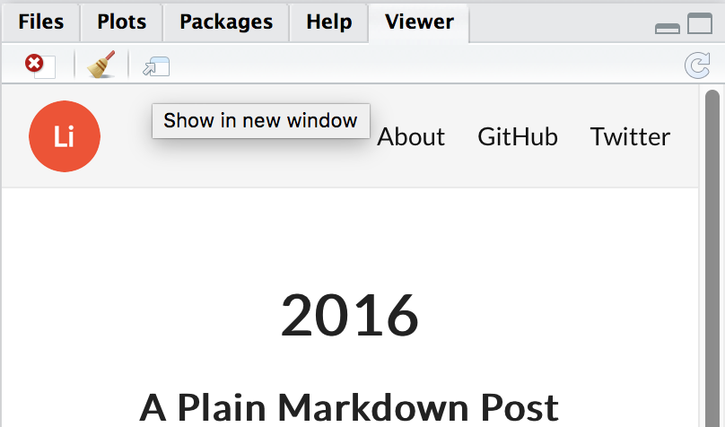
```
]

---
### Notation we will adopt: **Trailing slash**

- **Trailing slash** will indicate a directory name, e.g. **`content/`** means we are referring to a directory called *content*, not to a file named *content*.

```{r, eval=FALSE}
.
|
├── archetypes
├── config.toml #<<
    ├── about.md
    └── post
├── content
├── data
├── layouts
├── static 
└── themes

```

---
### Notation we will adopt: **Leading slash**

- **Leading slash** will indicate the root directory of your *project website*, e.g. **`/content/about.md`** means we are referring to `about.md` file which is under the root directory of the website project.  

```{r, eval=FALSE}
.
|
├── archetypes
├── config.toml #<<
    ├── about.md #<<
    └── post
├── content
├── data
├── layouts
├── static 
└── themes

```

---
class: inverse, center, middle
# Let's edit our website...


---
class: inverse, center, middle
#Step 1: logo 🛠⚙️💡
```{r, out.width = "400px", fig.align = 'middle', echo=FALSE}
knitr::include_graphics("images/blogdown/logo_eRum2020.png")
```
---
###<span style="color:#00B2EE">Step 1:</span> add a logo

The logo file belongs in the `/static/` directory:
> `/static/` stores all the static content for your future website: images, CSS, JavaScript, etc. When Hugo builds your site, all assets inside your static directory are copied over as-is.

1. Move `01-images` folder to `/static/`
2. Rename folder `images` (so now you have a `static/images/` folder with 2 .png files in it)
3. Update <span style="color:#EE2C2C">`config.toml`</span> and save
```{r, eval=FALSE}
    [params.logo]
    url = "eRum2020.png" #<<
    width = 50
    height = 50
    alt = "Logo"
```

---
###<span style="color:#104E8B">Step 1:</span> we've got a logo! 

```{r, out.width = "900px", fig.align = 'center', echo=FALSE}
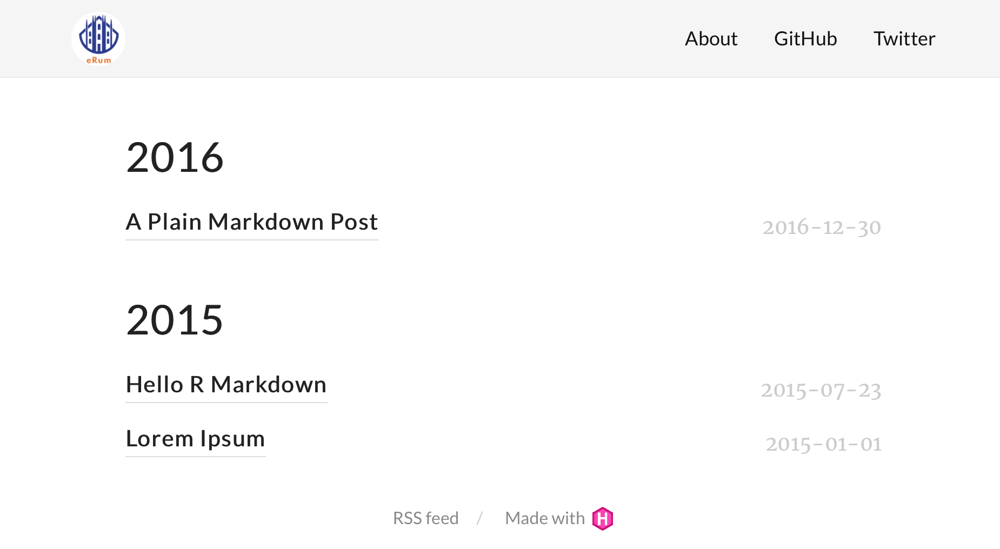
```

---
## .shadow-text[<span style="color:#4A708B")>Step 1:</span> We've learnt] 🥁🎺😎

`/themes/<THEME>/static/images/logo.png` 

can be overwritten by 

`/static/images/<eRum2020.png>`

Note that this will only work with Hugo templates that have the 'standard' Hugo folder structure.💡

---

.pull-left[
``````{r, eval=FALSE}
.
├── static
|    └── images
|        └── eRum2020.png #<<
└── themes
    └── hugo-lithium
        └── static
            ├── css
            ├── favicon.ico
            ├── fonts
            ├── images
            │   └── hugo-logo.png
            └── js
```
]

.pull-right[
``````{r, eval=FALSE}
.
├── static
|    └── images
|        └── eRum2020.png
└── themes
    └── hugo-lithium
        └── static
            ├── css
            ├── favicon.ico
            ├── fonts
            ├── images
            │   └── hugo-logo.png #<<
            └── js
```
]

---

class: inverse, center, middle
#Step 2: about 🛠⚙️💡

---
###<span style="color:#00B2EE">Step 2:</span> update the *about* page

1. Move `02-about.md` file to `/content/`

2. Delete the existing file `about.md`

3. Rename `02-about.md` → `about.md`
---

###<span style="color:#104E8B">Step 2:</span> we've got a logo! 

```{r, out.width = "800px", fig.align = 'center', echo=FALSE}
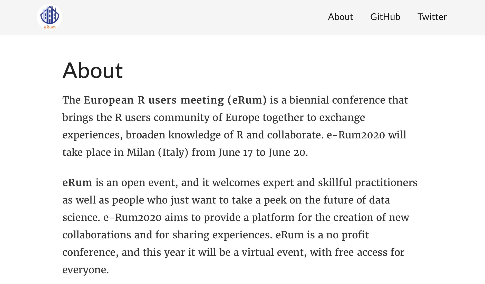
```
---

## .shadow-text[<span style="color:#4A708B")>Step 2:</span> We've learnt] 🥁🎺😎

>All `content` for your website will live inside this directory. Each top-level folder in Hugo is considered a content section. For example, if your website has two main sections *posts* and *about* page, there will be a directory at `content/posts` and a file `content/about.md`.

<https://gohugo.io/getting-started/directory-structure/>

---
```{r, eval=FALSE}
.
├── config.toml
├── content
│   ├── about.md #<<
│   └── post #<<
├── index.Rmd
├── myblogdown
├── public
├── static
└── themes
```
---
class: inverse, center, middle
#Step 3: emojis 🛠⚙️💡

---
###<span style="color:#00B2EE">Step 3:</span> enable the emojis 😁🤷🤦

Note the amendments you need to do to the top of your `config.toml` file.  

```{r, eval=FALSE}
baseurl = "/"
languageCode = "en-us"
title = "My awesome website" #<<
theme = "hugo-lithium"
googleAnalytics = ""
disqusShortname = ""
ignoreFiles = ["\\.Rmd$", "\\.Rmarkdown$", "_files$", "_cache$"]
enableEmoji = true #<<
```

Save the change and check the *about* page... it should show a ❤️

---
## .shadow-text[<span style="color:#4A708B")>Step 3:</span> We've learnt] 🥁🎺😎

> In your `config` file, you can direct Hugo as to how you want your website rendered, control your website’s menus, and arbitrarily define site-wide parameters specific to your project.

<https://gohugo.io/getting-started/configuration/>

---
class: inverse, center, middle
#Step 4: navigation bar 🛠⚙️💡

---
###<span style="color:#00B2EE">Step 4:</span> edit your navigation bar

Make the changes to your `config.toml` file:

```{r, eval=FALSE}
[[menu.main]]
    name = "About"
    url = "/about/"
    weight = 1 #<<
[[menu.main]]
    name = "Facebook" #<<
    url = "https://www.facebook.com/EuropeanRUsersMeeting2020" #<<
    weight = 2 #<<
[[menu.main]]
    name = "Twitter"
    url = "https://twitter.com/erum2020_conf" #<<
    weight = 3 #<<
```

Save the changes, Serve Site and check the links.

---
## .shadow-text[<span style="color:#4A708B")>Step 4:</span> We've learnt] 🥁🎺😎

The `[[menu.main]]` in your `config` file enables you to edit and add navigation options.  

> A menu entry in a menu-template has specific variables and functions to make menu management easier.

<https://gohugo.io/variables/menus/>

---
class: inverse, center, middle

##Are we starting to feel confortable learning Elaine's moves?! 😃🎵🎶

```{r, out.width = "300px", echo=FALSE}
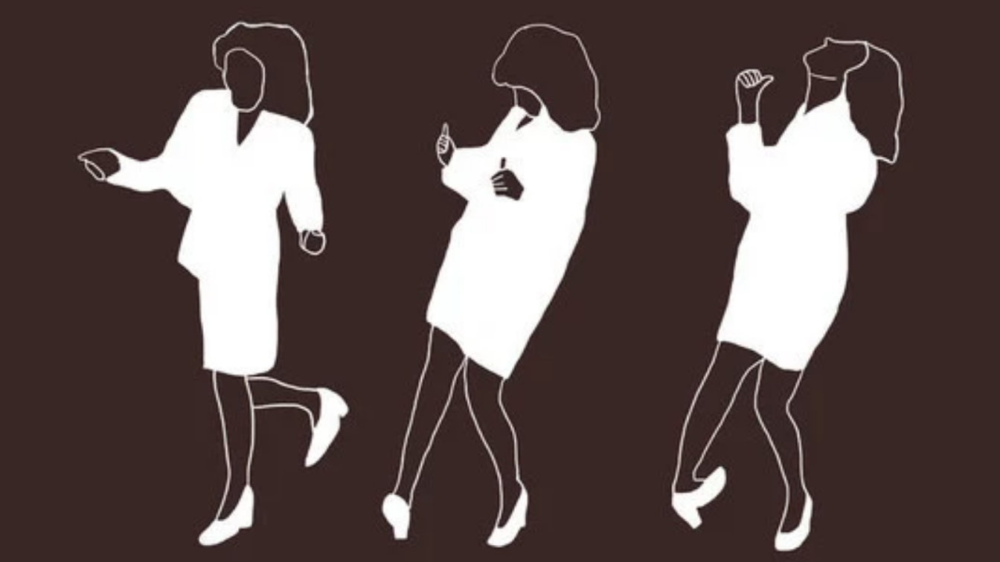
```
---
class: inverse, center, middle
#Step 5: css 🛠⚙️💡
---
###<span style="color:#00B2EE">Step 5:</span> customise the look 💅💄🎨

1) In `/static/` create a new directory `css` and move `05-erum.css` file to `/static/css/`

--
.pull-left[
2) Rename `05-erum.css` --> `erum.css`
```{r, eval=FALSE}
.
├── config.toml
├── content
├── public
├── static
│   ├── css
│   │   └── erum.css #<<
│   ├── images
│   └── post
└── themes
```
]

.pull-right[
3) In `config.toml`, add the highlighted line:

```{r, eval=FALSE}
[params]
    description = "A website built through Hugo and blogdown."
    customCSS = ["css/erum.css"] #<<
```
]
---
###<span style="color:#104E8B">Step 5:</span> we've got a look! 
```{r, out.width = "750px", fig.align = 'center', echo=FALSE}
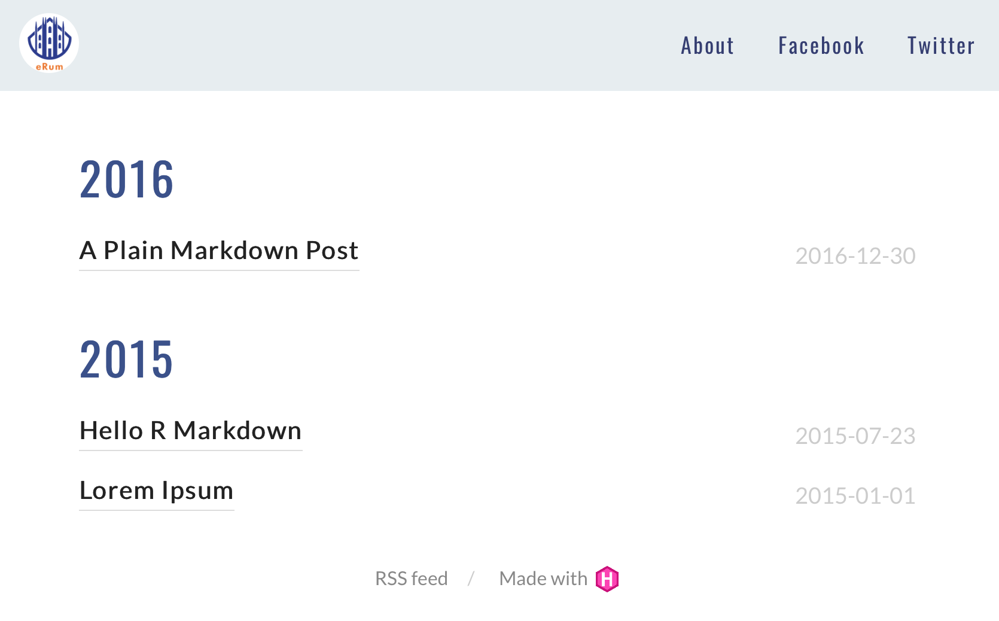
```

---
## .shadow-text[<span style="color:#4A708B")>Step 5:</span> We've learnt] 🥁🎺😎

We have seen that 

`/themes/<THEME>/static/css/main.css`

could be overwritten by style rules present in:

`/static/<css/datateka.css>`

---

```{r, eval=FALSE}
.
├── config.toml
├── content
├── index.Rmd
├── myblogdown
├── public
├── static #<<
│   ├── css #<<
│   │   └── erum.css #<<
│   ├── images
│   └── post
└── themes #<<
    └── hugo-lithium #<<
        └── static #<<
            └── css #<<
			       └── main.css #<<
```
---
class: inverse, center, middle
#Step 6: Font Awesome 🛠⚙️💡
---
###<span style="color:#00B2EE">Step 6:</span> use Font Awesome 

> Font Awesome is a font and icon toolkit based on CSS and LESS.

<https://en.wikipedia.org/wiki/Font_Awesome>

Go [here](https://fontawesome.com/v4.7.0/get-started/) to enter your email address and receive a Font Awesome embed code. We'll use the one you've downloaded with the workshop bundle for today's demo.

To use them, you need 2 things:

- the Font Awesome CSS file, and

- a script that directs your site to where the fonts can be found (via Font Awesome's Content Delivery Network, or CDN)

---
###<span style="color:#00B2EE">Step 6:</span> use Font Awesome 

1a) Move 06-font-awesome.min.css to `/static/css/`

2a) Rename `06a-font-awesome.min.css` --> `font-awesome.min.css`

3b) Create a new directory `layouts/` and within it create a subdirectory called `partials`

4b) Move other `06b-head_custom.html` and `06b-nav.html` to `/layouts/partials/` and renamed the files by removing `06b-` from their names.

---
```{r, eval=FALSE}
.
├── config.toml
├── content
├── index.Rmd
├── layouts #<<
│   └── partials #<<
│       ├── head_custom.html #<<
│       └── nav.html #<<
├── myblogdown
├── public
├── static #<<
│   ├── css #<<
│   │   └── fontawesome.min.css #<<
│   ├── images
│   └── post
└── themes

```
---
###<span style="color:#00B2EE">Step 6:</span> Make changes to these sections in your `config.toml`:
```{r, eval=FALSE}
[[menu.main]]
    name = "About"
    pre = "" #<<
    url = "/about/"
    weight = 1
[[menu.main]]
    name = "Facebook"
    pre = "fa-facebook-square" #<<
    url = "https://www.facebook.com/EuropeanRUsersMeeting2020"
    weight = 2
[[menu.main]]
    name = "Twitter"
    pre = "fa-twitter-square" #<<
    url = "https://twitter.com/erum2020_conf"
    weight = 3
```
---
###<span style="color:#00B2EE">Step 6:</span> Make changes to these sections in your `config.toml`:

```{r, eval=FALSE}
.
.
.

[params]
    description = "A website built through Hugo and blogdown."
    customCSS = ["css/erum.css", "css/font-awesome.min.css"] #<<
```

---
###<span style="color:#104E8B">Step 6:</span> look at our awesome font and icons! 

```{r, out.width = "700px", fig.align = 'center', echo=FALSE}
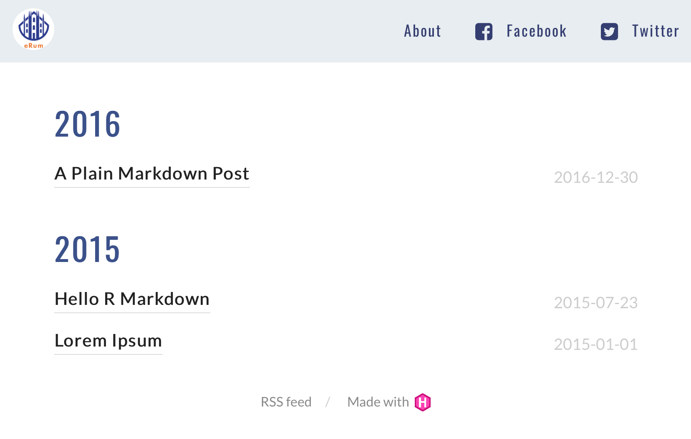
```

---
## .shadow-text[<span style="color:#4A708B")>Step 6:</span> We've learnt] 🥁🎺😎

`/themes/<THEME>/layouts/partials/*<PARTIALNAME>.html`

Could be overwritten by:

`/layouts/partials/*<PARTIALNAME>.html`

The `<PARTIALNAME>`s must match; unless you want to edit how the partials are called within your templates:

  `{{ partial "<PATH>/<PARTIAL>.html" .  }}`
  
https://gohugo.io/templates/partials/

---
```{r, eval=FALSE}
├── layouts #<<
│   └── partials #<<
│       ├── head_custom.html #<<
│       └── nav.html #<<
.
└── themes #<<
    └── hugo-lithium #<<
        └── layouts #<<
            └── partials #<<
                ├── disqus.html
                ├── footer.html
                ├── footer_highlightjs.html
                ├── footer_mathjax.html
                ├── head.html
                ├── head_custom.html #<<
                ├── head_highlightjs.html
                ├── header.html
                └── nav.html #<<
```
---
class: inverse, center, middle
#Step 7: homepage 🛠⚙️💡
---
###<span style="color:#00B2EE">Step 7:</span> create a homepage 

Where to move the file `07-index.html`?

1) Move `07-index.html` to `/layouts/`<sup>*</sup> 

2) Rename `07-index.html` to `index.html`

3) Edit the `config.toml` file

```{r, eval=FALSE}
[params]
    description = "A website built through Hugo and blogdown. We can add any text we would like to appear on our home page. This is my first website design using blogdown in R at a workshop with Tanja. 😃 "
    chapter = "Milan, June 2020"
    customCSS = ["css/erum.css", "css/font-awesome.min.css"]
```

.footnote[
[*] NOT to /layouts/partials/
]
---
###<span style="color:#104E8B">Step 7:</span> look at our home page! 

```{r, out.width = "750px", fig.align = 'center', echo=FALSE}
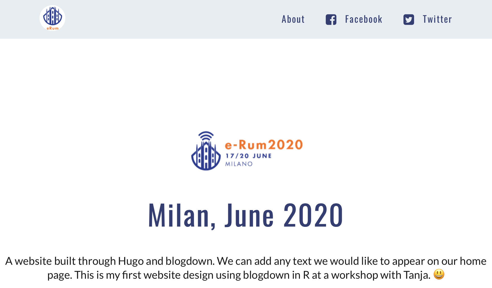
```
---
## .shadow-text[<span style="color:#4A708B")>Step 7:</span> We've learnt] 🥁🎺😎

Even when there is no `index.html` file here: `/themes/<THEME>/layouts/index.html`

--
We can make one that serves as the homepage here: `/layouts/index.html`

```{r, eval=FALSE}
.
├── layouts #<<
│   ├── index.html #<<
│   └── partials #<<
.
└── themes #<<
    └── hugo-lithium #<<
        └── layouts #<<
            ├── _default
            └── partials
```

---
## .shadow-text[<span style="color:#4A708B")>Step 7:</span> We've learnt] 🥁🎺😎

The filename `index.html` has special status in Hugo, and is **not** a partial layout template.

You could also force a homepage by creating an `_index.md` file that lives at the root of your `/content/` folder (i.e., `/content/_index.md`)

<https://gohugo.io/templates/homepage/>
---
class: inverse, center, middle
#Step 8: posts 🛠⚙️💡
---
###<span style="color:#00B2EE">Step 8:</span> adding a post 

Add a post section to your navigation bar by adding the highlighted lines to your `config.toml` file.  

```{r, eval=FALSE}
.
.
.
[[menu.main]]
    name = "Twitter"
    pre = "fa-twitter-square"
    url = "https://twitter.com/erum2020_conf"
    weight = 3
[[menu.main]] #<<
    name = "Posts" #<<
    pre = "fa-bullhorn" #<<
    url = "/post/" #<<
    weight = 4 #<<
```
---
###<span style="color:#104E8B">Step 8:</span> we've got a link for the posts!


```{r, out.width = "800px", fig.align = 'center', echo=FALSE}
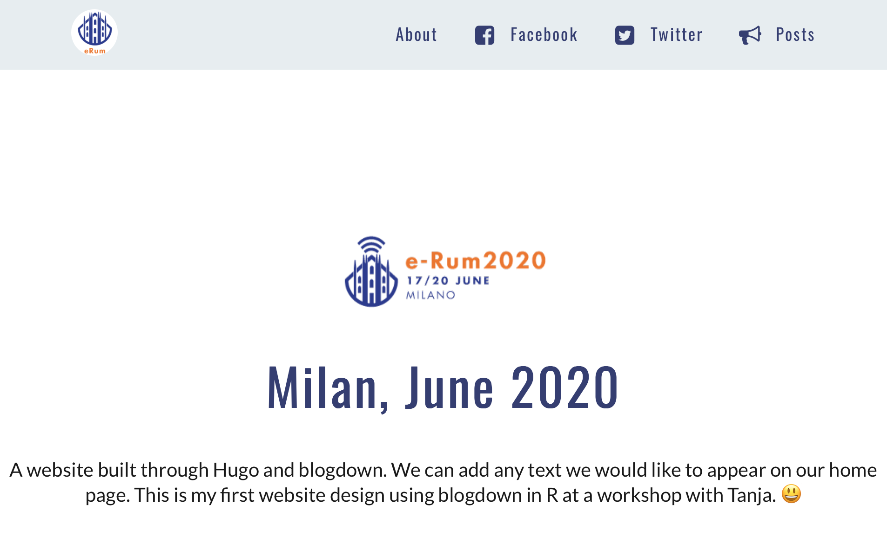
```

---
###<span style="color:#00B2EE">Step 8:</span> write a post ✍️
Go to `Addins` and select `New Post` to which you are going to add the properties
.pull-left[
```{r, out.width = "350px", fig.align = 'center', echo=FALSE}
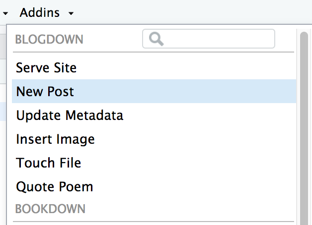
```
]
.pull-right[
```{r, out.width = "300px", fig.align = 'center', echo=FALSE}
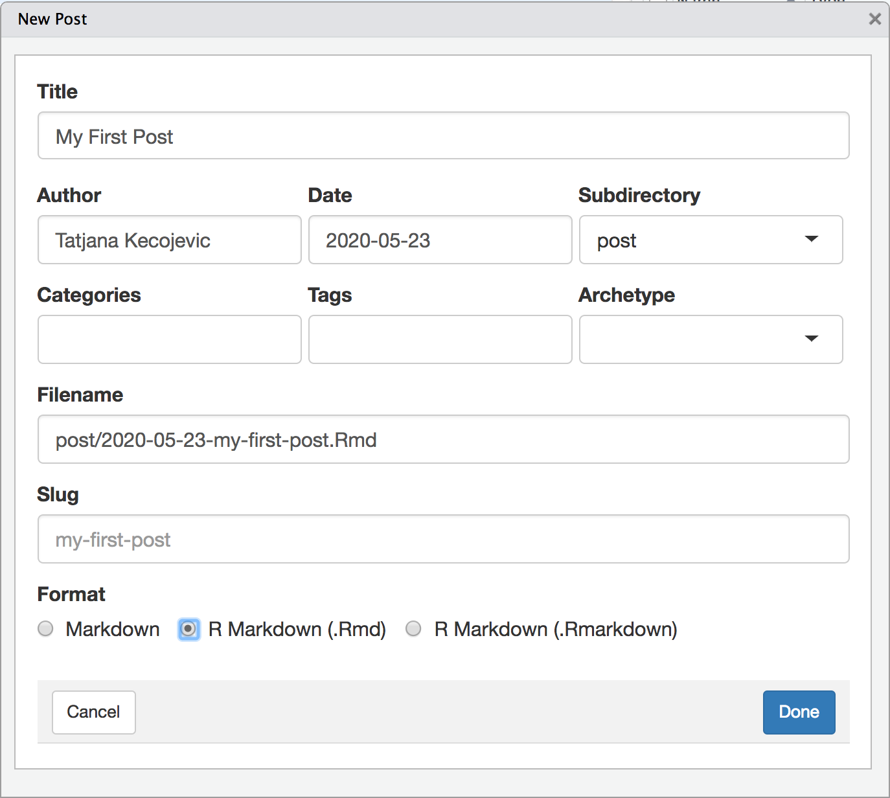
```
]

You can start writing your post as an R Markdown file 😊
```{r, out.width = "300px", fig.align = 'center', echo=FALSE}
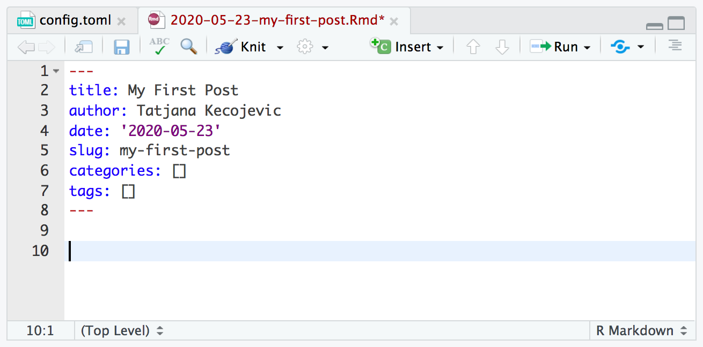
```

---
###<span style="color:#104E8B">Step 8:</span> we've got our first posts!

```{r, out.width = "750px", fig.align = 'center', echo=FALSE}
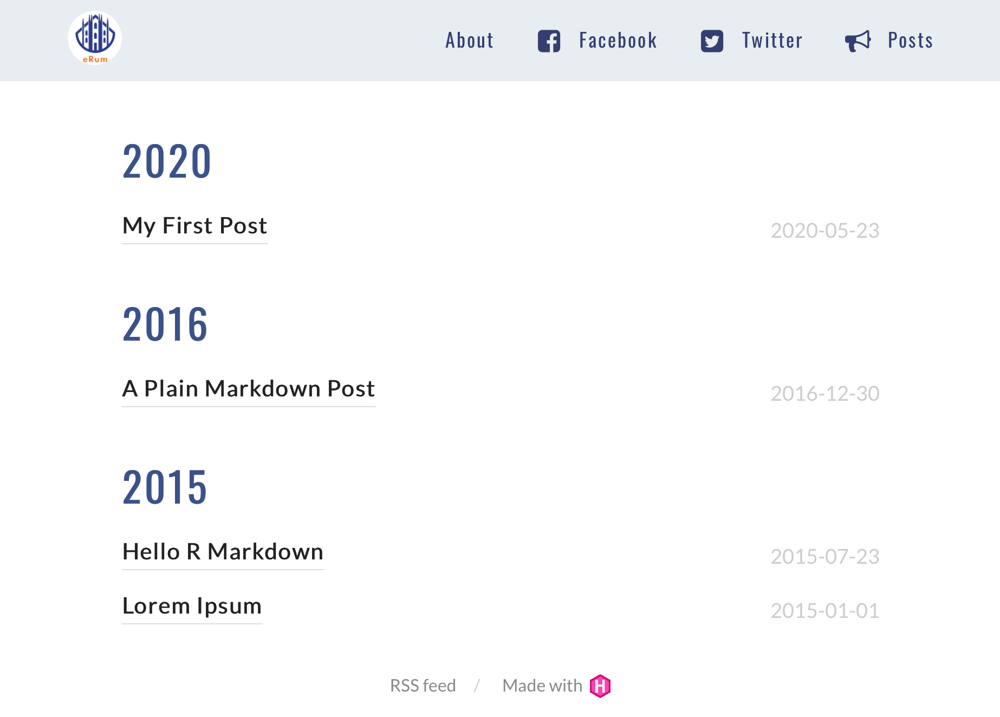
```

---
###<span style="color:#00B2EE">Step 8:</span> removing the `default` posts 🤷

Click on the `Files` tab and navigate to the `/content/post/` directory to get the list of the *posts files*

--

Select the ones you don't want and click on `Delete` ❌. 

```{r, out.width = "250px", fig.align = 'center', echo=FALSE}
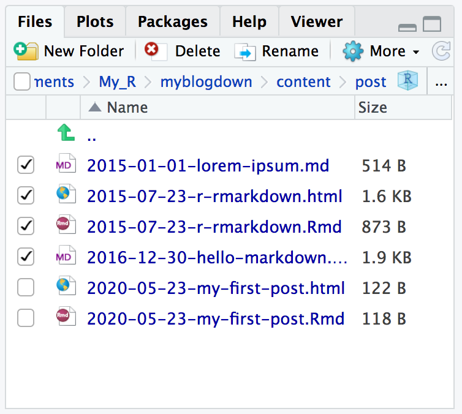
```
--

`Serve Site` to have a look
```{r eval=FALSE}
blogdown::serve_site()
```

---
###<span style="color:#104E8B">Step 8:</span> look at your posts!

```{r, out.width = "1000px", fig.align = 'center', echo=FALSE}
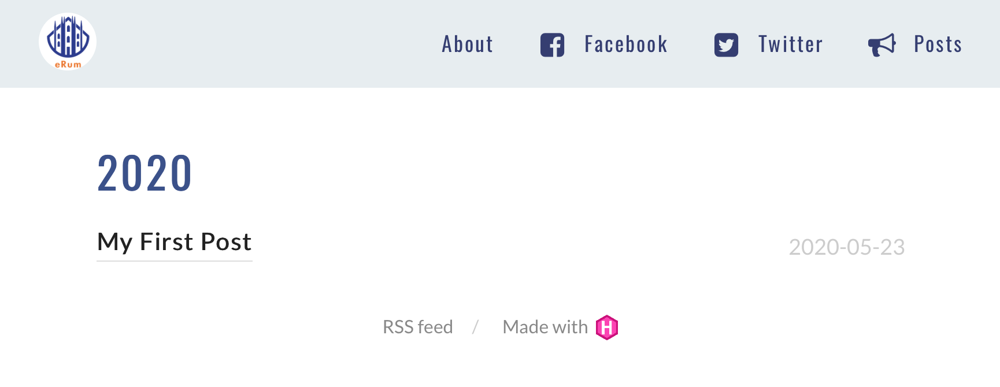
```
---
## .shadow-text[<span style="color:#4A708B")>Step 8:</span> We've learnt] 🥁🎺😎

Adding a post is easy by selecting the option `New Post` from the `Addins` drop-down menu and writing it as a `.Rmd` file. This file will be automatically placed inside the `/content/posts/` directory: `/content/posts/2020-05-23-my-first-post.Rmd`

```{r, eval=FALSE}
.
├── config.toml
├── content #<<
│   └── post #<<
│       ├── 2020-05-23-my-first-post.Rmd #<<
│       └── 2020-05-23-my-first-post.html #<<
├── data
├── layouts
├── static 
└── themes


```

---
class: inverse, center, middle

##Let's do Elaine's Dance!!! 😃🎵🎶


---

class: inverse, center, middle

# Deploy your website 🧞

---
### Deployment

Click on the `Git` tab and select all of the files to `commit`

```{r, out.width = "350px", fig.align = 'center', echo=FALSE}
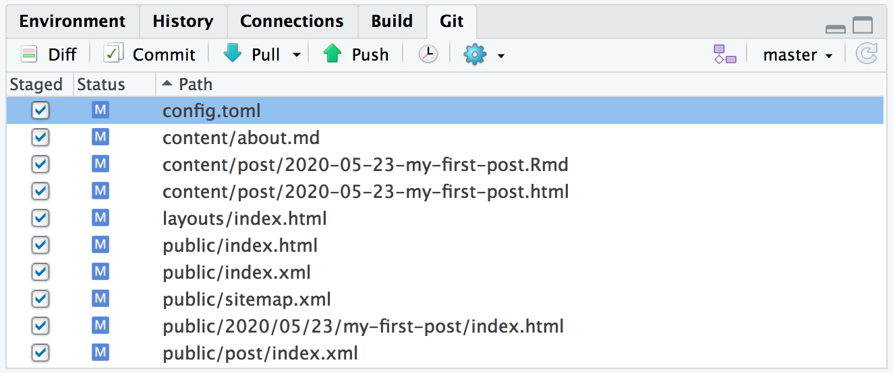
```

```{r, out.width = "600px", fig.align = 'center', echo=FALSE}
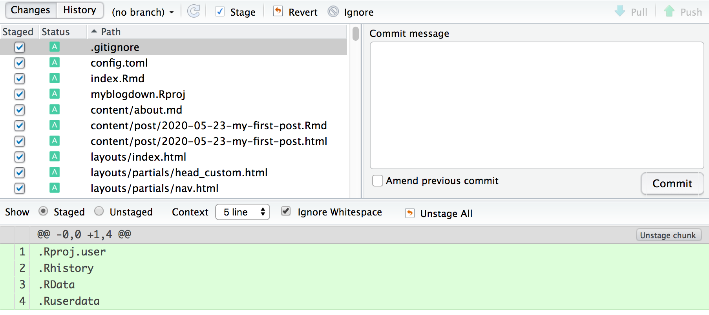
```
---
Click to `push`

```{r, out.width = "700px", fig.align = 'center', echo=FALSE}
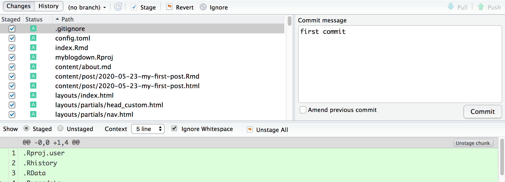
```

```{r, out.width = "500px", fig.align = 'center', echo=FALSE}
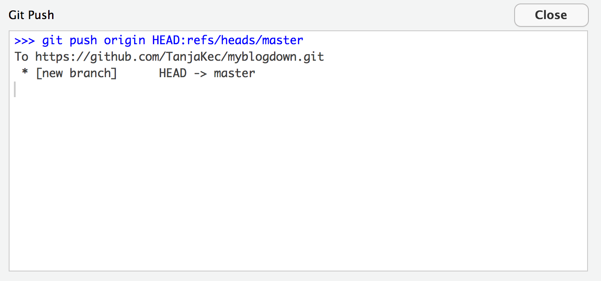
```

---
### Check your Git Repo

```{r, out.width = "700px", fig.align = 'center', echo=FALSE}
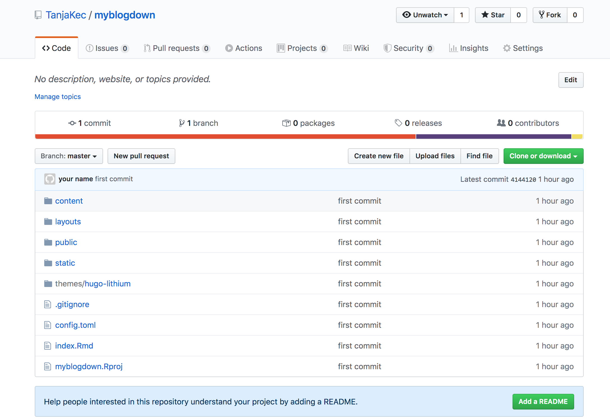
```
---
class: inverse, center, middle

###Congratulations! You are one step away from getting your website up and running!!!! 👍😃


---
### Have you heard about [Netlify](https://www.netlify.com/)?

```{r, out.width = "250px", fig.align = 'center', echo=FALSE}

```

> Consider Netlify instead of GitHub Pages for Your Static Websites.

> Do not use Github pages or the *.github.io subdomain. Use Netlify instead. Netlify is the new and much better Github pages.

*Yihui Xie*

<https://yihui.name/en/2017/06/netlify-instead-of-github-pages/>
---

```{r, out.width = "700px", fig.align = 'center', echo=FALSE}
knitr::include_graphics("images/Netlify/deploy_in_netlify.png")
```

> Deploying in Netlify through GitHub is smooth.

> When you are ready to deploy, commit your changes and push to [GitHub](https://github.com), then go online to [Netlify](https://www.netlify.com/).

*Alison Presmanes Hill*

<https://alison.rbind.io/post/up-and-running-with-blogdown/>
---
Go to [Netlify](https://www.netlify.com/) and open an account (the easiest way is to use your [GitHub](https://github.com) login).

Click on *New site from Git* button

```{r, out.width = "300px", fig.align = 'center', echo=FALSE}
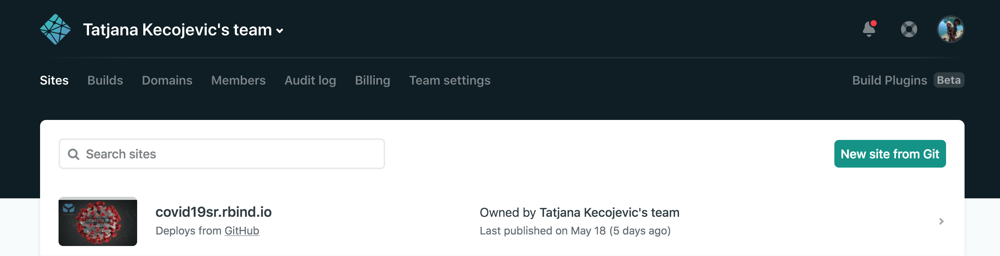
```

Select *GitHub* option to *Continue Deployment*
```{r, out.width = "300px", fig.align = 'center', echo=FALSE}
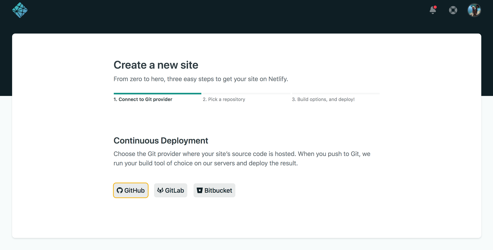
```

*Select the repository* with the website
```{r, out.width = "300px", fig.align = 'center', echo=FALSE}
knitr::include_graphics("images/Netlify/new_site_from_git2.png")
```

---
Select your site repo and klick on *Deploy site* button at the bottom of the page.

```{r, out.width = "500px", fig.align = 'center', echo=FALSE}
knitr::include_graphics("images/Netlify/deploy_site.png")
```
---
Deployment might take a few seconds...

```{r, out.width = "500px", fig.align = 'center', echo=FALSE}
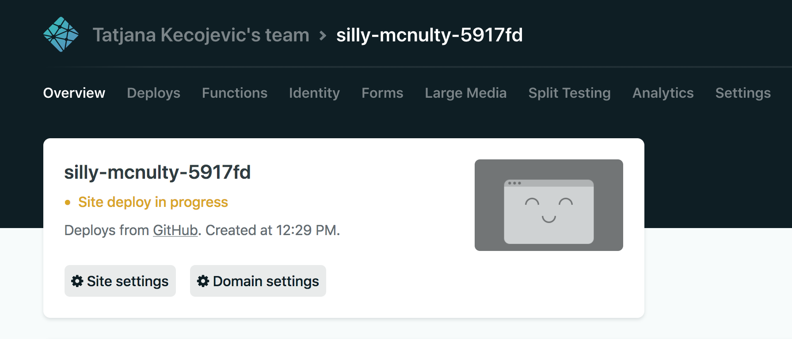
```

Go into *Site Settings* and click on *Change site name*. 

```{r, out.width = "500px", fig.align = 'center', echo=FALSE}
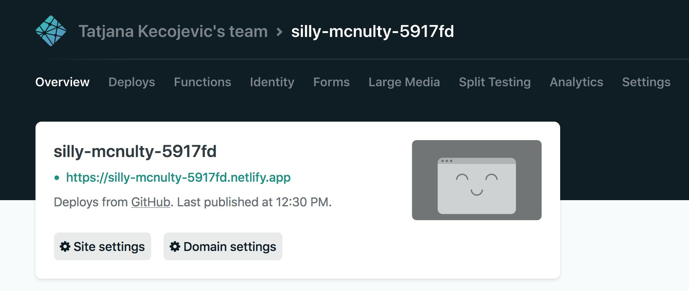
```

---
Change the name...

```{r, out.width = "400px", fig.align = 'center', echo=FALSE}
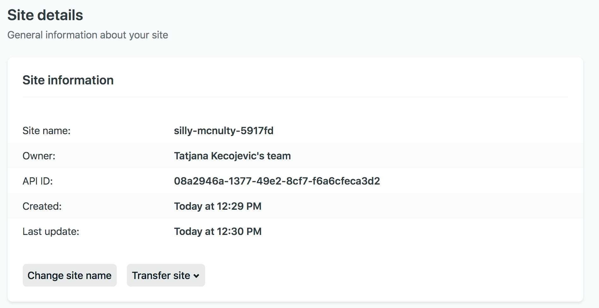
```

I'll call it **`myawesomewebsite`**

```{r, out.width = "450px", fig.align = 'center', echo=FALSE}
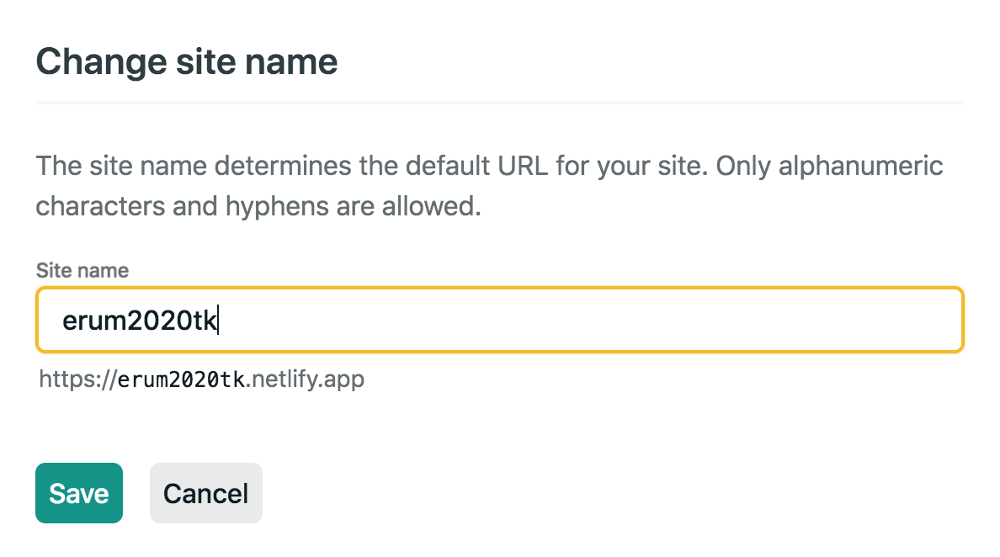
```

---
This is it...

```{r, out.width = "650px", fig.align = 'center', echo=FALSE}
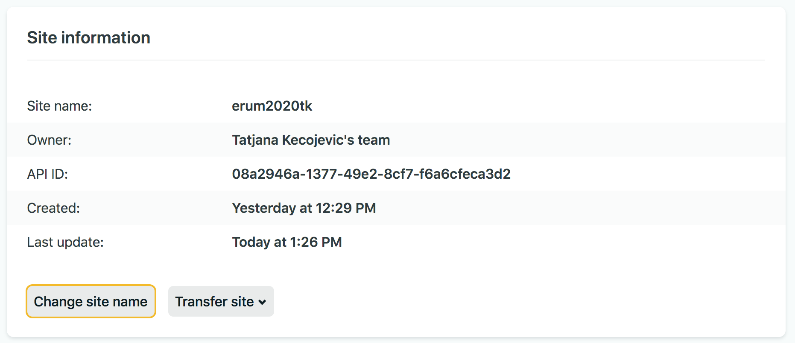
```

```{r, out.width = "650px", fig.align = 'center', echo=FALSE}
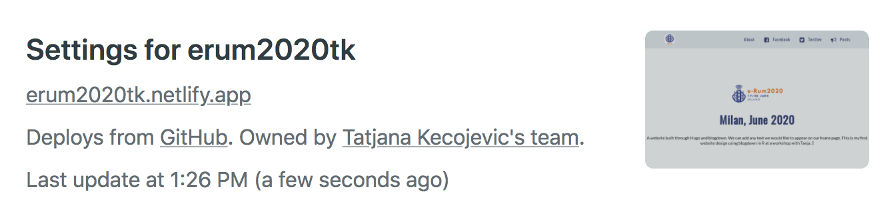
```

---

```{r, out.width = "900px", fig.align = 'center', echo=FALSE}
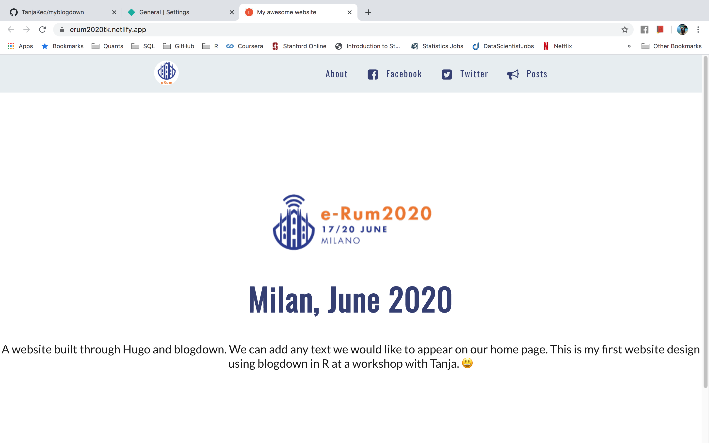
```
---

A few more things... 🤔

## Final edit of your config.toml: update `baseurl`

At the top of the config.toml insert the name of your website

```{r, eval=FALSE}
baseurl = "https://erum2020tk.netlify.app/" #<<
languageCode = "en-us"
title = "My awesome website"
theme = "hugo-lithium"
googleAnalytics = ""
disqusShortname = ""
ignoreFiles = ["\\.Rmd$", "\\.Rmarkdown$", "_files$", "_cache$"]
enableEmoji = true
```
---
### You can host your site as `rbind` subdomain 

[rbind](https://github.com/rbind) - Bind all websites in the `R` and `stats` community. 
    

<https://covid19sr.rbind.io/> is an example of what to request if you wish to move your site to [rbind](https://github.com/rbind).    
```{r, out.width = "500px", fig.align = 'center', echo=FALSE}
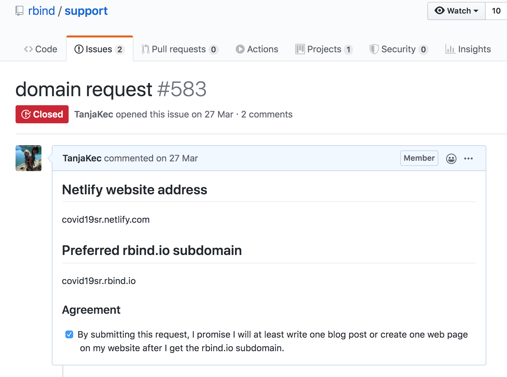
```    

<https://support.rbind.io/about/>
---

### Some useful links

[RStudio: Making websites with Markdown](https://www.rstudio.com/resources/webinars/introducing-blogdown/)

A tutorial on using `blogdown`.

--

<https://blogdown-demo.netlify.com> GitHub: <https://github.com/apreshill/blogdown-demo>

A minimal website example using the blogdown site by [Alison Presmanes Hill](https://alison.rbind.io).

--
[Up and running with blogdown](https://alison.rbind.io/post/up-and-running-with-blogdown/#build-your-site-in-rstudio)

[Alison's](https://amber.rbind.io/) well structured and easy to follow tutorial higlighting the key steps when building a website using blogdown.

--

[`blogdown`: Creating Websites with R Markdown](https://bookdown.org/yihui/blogdown/) 

by [Yihui Xie](https://yihui.name/), [Amber Thomas](https://amber.rbind.io/), [Alison Presmanes Hill](https://alison.rbind.io)
---


class: inverse, center, middle
##Do the Cosmo Dance?! 🤪🎵🎶


---
class: inverse, center, middle

##Thanks!

To Yihui and RStudio for the blogdown package

To the rbind group for support

Special thanks to Alison for sharing her knowledge and making her material reproducible and freely available. This workshop has been created with Alison's support and it is based on her 'up and running with blogdown tutorial' available at <https://github.com/apreshill/blogdown-workshop>

[https://sisteranalyst.org](https://sisteranalyst.org) 

@SISTERANALYST 

[tanjakec.github.io](tanjakec.github.io)

@Tatjana_Kec


Slides created via the `R` package [**xaringan**](https://github.com/yihui/xaringan).

The chakra comes from [remark.js](https://remarkjs.com), [**knitr**](http://yihui.name/knitr), and [R Markdown](https://rmarkdown.rstudio.com).
---
https://alison.rbind.io/categories/netlify/
